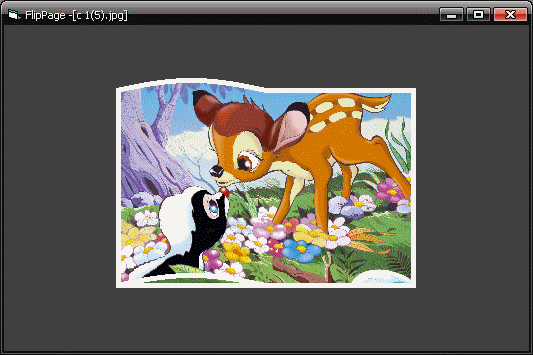

<div align="center">

## FlipPage


</div>

### Description

Flip page with perspective and sine wave -&gt; Page Curve
 
### More Info
 


<span>             |<span>
---                |---
**Submitted On**   |2010-01-06 00:38:22
**By**             |[Tmax](https://github.com/Planet-Source-Code/PSCIndex/blob/master/ByAuthor/tmax.md)
**Level**          |Advanced
**User Rating**    |5.0 (105 globes from 21 users)
**Compatibility**  |VB 6\.0
**Category**       |[Graphics](https://github.com/Planet-Source-Code/PSCIndex/blob/master/ByCategory/graphics__1-46.md)
**World**          |[Visual Basic](https://github.com/Planet-Source-Code/PSCIndex/blob/master/ByWorld/visual-basic.md)
**Archive File**   |[FlipPage217224182010\.zip](https://github.com/Planet-Source-Code/tmax-flippage__1-72803/archive/master.zip)

### API Declarations

```
Private Declare Function StretchBlt Lib "gdi32" ( _
  ByVal hDC As Long, _
  ByVal x As Long, _
  ByVal Y As Long, _
  ByVal nWidth As Long, _
  ByVal nHeight As Long, _
  ByVal hSrcDC As Long, _
  ByVal XSrc As Long, _
  ByVal YSrc As Long, _
  ByVal nSrcWidth As Long, _
  ByVal nSrcHeight As Long, _
  ByVal dwRop As Long) As Long
```


